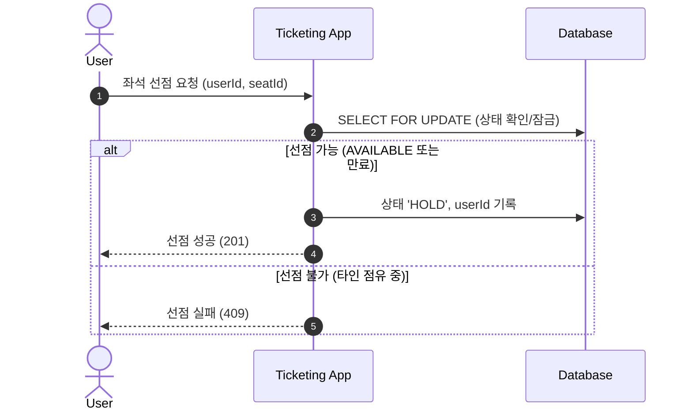
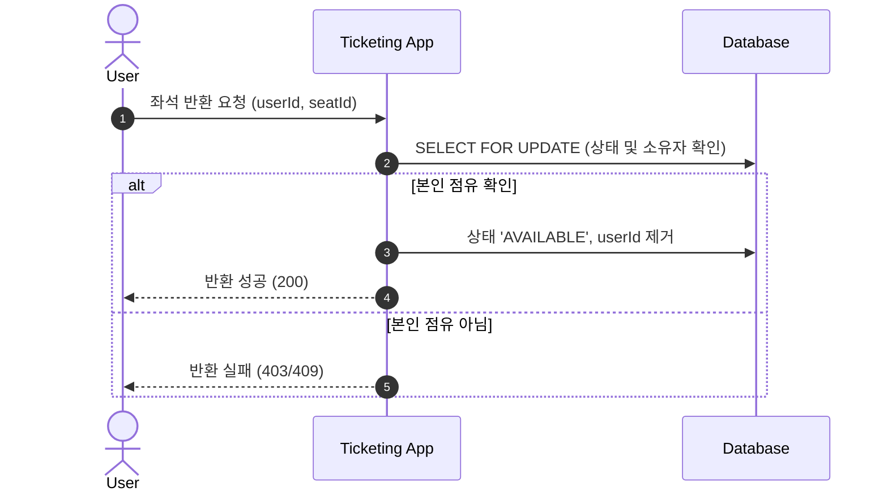

---
trigger: model_decision
description: seat-allocation-flow
---

좌석 배정(Allocation) 흐름
===

개요
---
사용자는 원하는 좌석을 선점(Hold)하거나, 마음이 변했을 때 반환(Release)할 수 있습니다.

RDB 기반 MVP 흐름
---

### 1. 좌석 선점 (Hold)


### 2. 좌석 반환 (Release)


핵심 컴포넌트
---

### 1. Allocation Service
- `allocateSeat(command)`: 좌석 선점(Hold) 로직 수행
- `releaseSeat(command)`: 좌석 반환(Release) 로직 수행

### 2. API 엔드포인트

- **Hold**: `POST /api/matches/{matchId}/allocation/seats/{seatId}/hold`
- **Release**: `POST /api/matches/{matchId}/allocation/seats/{seatId}/release`
- **Complete**: `POST /api/matches/{matchId}/allocation/seats/complete`

데이터베이스 스키마
---
`allocations` 테이블은 `user_id`를 통해 현재 누가 좌석을 점유하고 있는지 추적합니다.

상태 전이
---
```
AVAILABLE <--(Hold)--> HOLD <--(Release)--> AVAILABLE
HOLD --(Complete)--> RESERVED --(Pay)--> OCCUPIED
```
