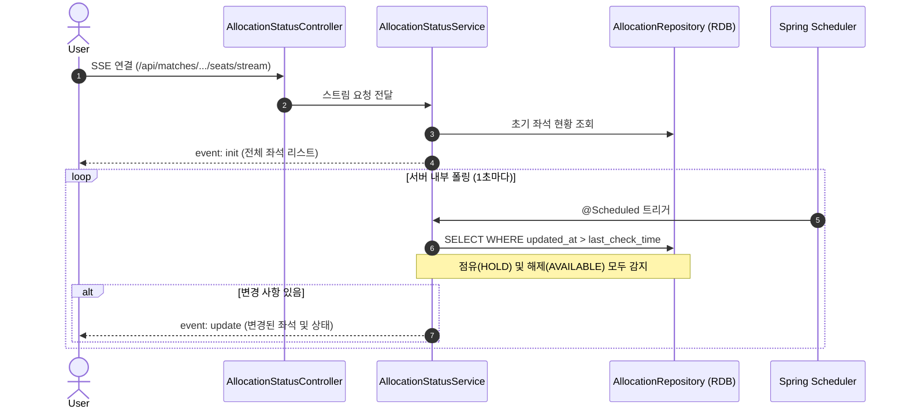
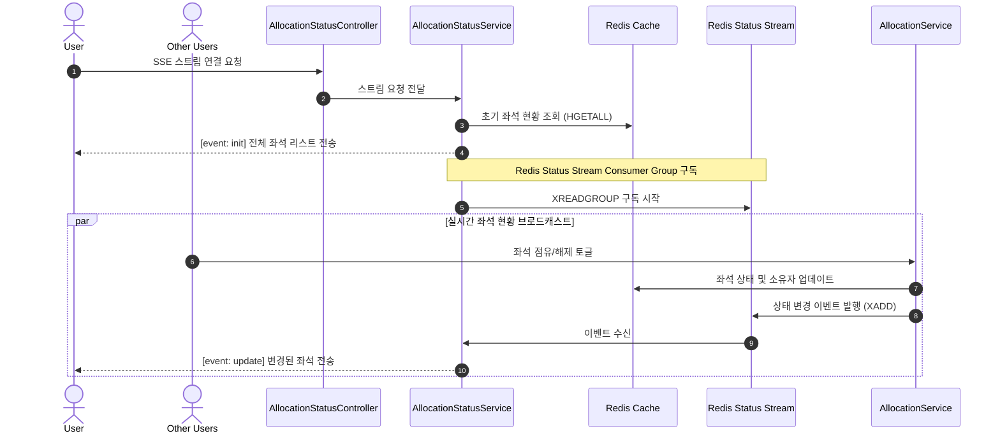

---
trigger: model_decision
description: seat-status-stream-flow
---

실시간 좌석 배정 현황(AllocationStatus Stream) 흐름
===

개요
---
좌석 현황 제공 방식은 인프라 환경에 따라 두 가지로 구분됩니다:
- **MVP (RDB + SSE)**: 서버 내부 DB 폴링 + SSE 푸시
- **고가용성 (Redis Status Stream + SSE)**: Redis Stream 이벤트 구독 + SSE 푸시

**공통점**: 둘 다 SSE를 사용하여 클라이언트에 `AllocationStatus` 변경 사항을 실시간 푸시
**차이점**: 변경 감지 방법 (서버 DB 폴링 vs Redis Status Stream 구독)

1. RDB 기반 MVP 흐름 (Server-side Polling + SSE)
---
초기 개발 단계에서는 **SSE를 사용하되**, 서버가 주기적으로 DB를 폴링하여 변경 사항을 감지합니다.



### MVP 특징
- ✅ **SSE 사용**: 클라이언트는 한 번만 연결, 서버가 푸시
- ✅ **낮은 인프라 복잡도**: Redis 불필요, RDB만으로 동작
- ✅ **실시간 푸시**: 점유/해제 발생 시 즉시 클라이언트에 전달
- ⚠️ **서버 폴링 오버헤드**: 주기적 DB 조회 발생

2. Redis 기반 고가용성 흐름 (SSE + Redis Status Stream)
---
트래픽이 증가하면 Redis Status Stream과 SSE를 도입하여 서버 푸시 방식으로 실시간성을 높입니다.



### 고가용성 특징
- ✅ **즉각적인 전달**: 이벤트 발생 즉시 클라이언트에 전달 (폴링 지연 없음)
- ✅ **토글 대응**: 점유 해제 시에도 즉시 이벤트 발행 및 전파
- ✅ **수평 확장**: Redis Status Stream Consumer Group으로 다중 인스턴스 지원

핵심 컴포넌트
---

### 1. AllocationStatusService
- **책임**: SSE 연결 관리 및 실시간 좌석 배정 현황(`AllocationStatus`) 제공.
- **구현**:
  - MVP: `LoadAllocationStatusPort`를 통해 DB 폴링.
  - Redis: `SubscribeAllocationEventPort` (혹은 RedisAdapter)를 통해 스트림 구독.

### 2. SSE 응답 형식
`AllocationStatusStreamUpdateResponse` 참조.

```json
// 점유(HOLD) 시
{
  "status": 200,
  "data": { "seatId": 123, "status": "HOLD" }
}

// 해제(AVAILABLE) 시
{
  "status": 200,
  "data": { "seatId": 123, "status": "AVAILABLE" }
}
```

관련 문서
---
- `allocation-status-strategy.md`: 상세 구현 가이드
- `../flow.md`: 좌석 배정(Allocation) 흐름
- `../../ticketing/overall-flow.md`: 전체 티켓팅 과정

