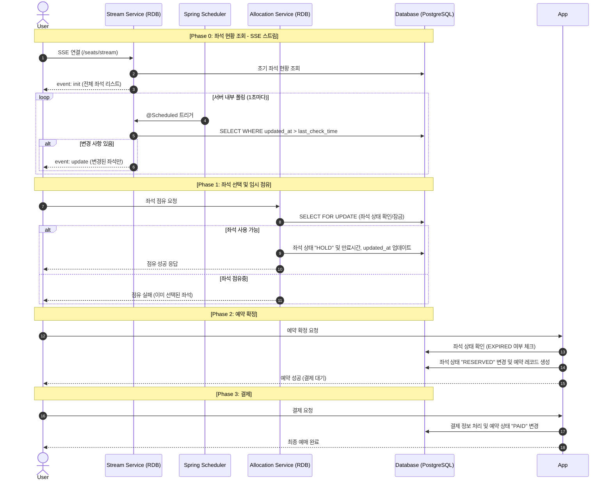
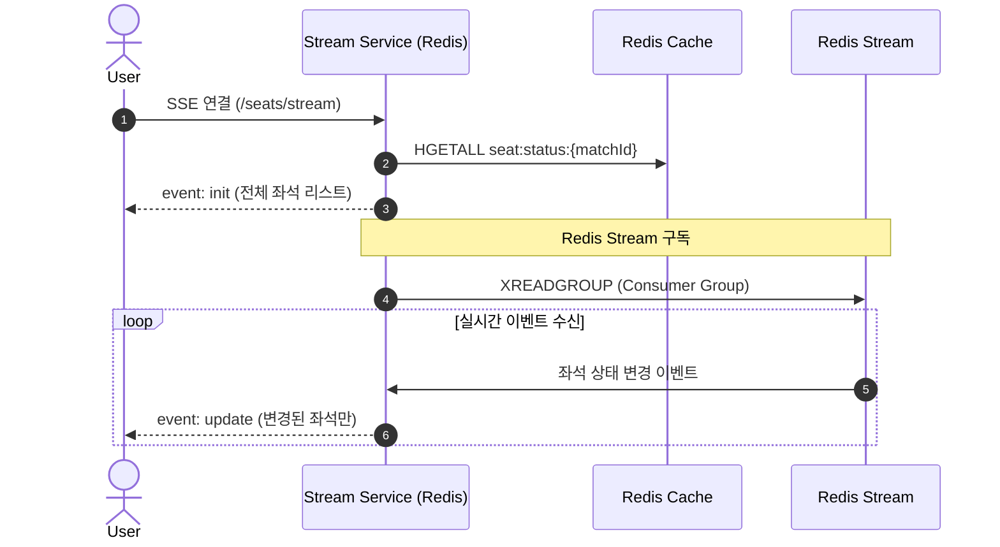
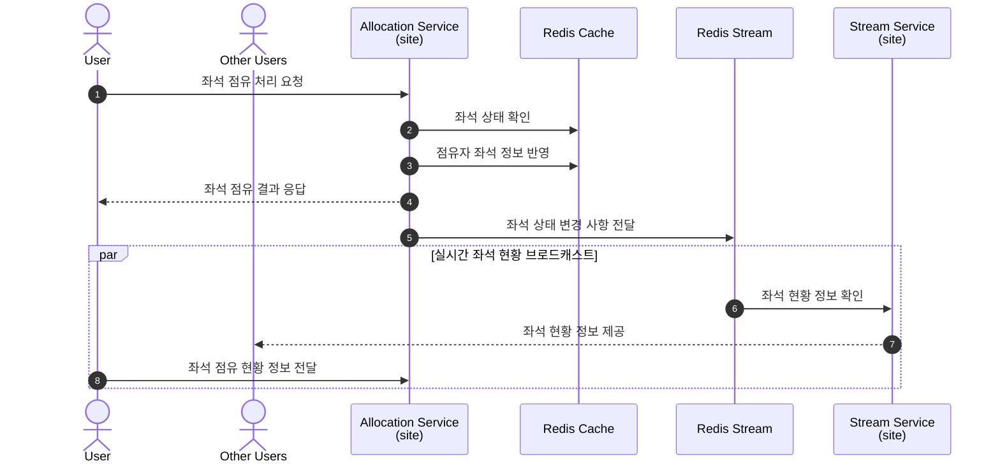
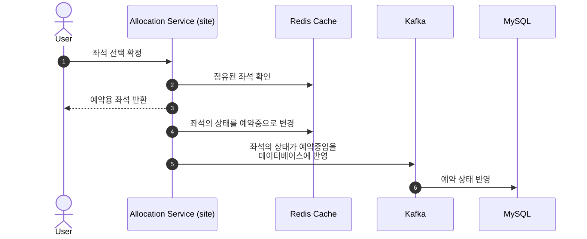
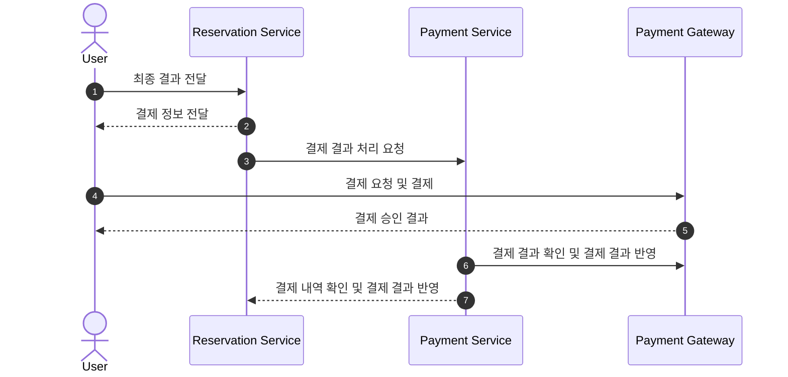

---
trigger: model_decision
description: ticketing-flow
---

입장권 예매 (Ticketing) 과정
===

1. RDB 기반 MVP 흐름 (현재 타겟)
---
초기 개발 단계에서는 인프라 복잡도를 낮추기 위해 RDB(PostgreSQL) 만을 사용하여 정합성을 보장합니다.

**핵심 특징**:
- ✅ **좌석 현황**: SSE 사용 + 서버 내부 1초 주기 DB 폴링
- ✅ **좌석 점유**: RDB 비관적 잠금 (SELECT FOR UPDATE)
- ✅ **단순 구조**: Redis, Kafka 불필요

---

2. 고가용성 설계 (추후 개선 방향)
---
트래픽 규모에 따라 Redis와 Kafka를 도입하여 가용성과 확장성을 높이는 상세 설계입니다.

**핵심 특징**:
- ✅ **좌석 현황**: SSE를 통한 실시간 서버 푸시 (폴링 불필요)
- ✅ **좌석 점유**: Redis Lua Script를 통한 원자적 연산
- ✅ **이벤트 브로드캐스팅**: Redis Stream으로 모든 클라이언트에 실시간 전달
- ⚠️ **인프라 복잡도**: Redis, Kafka, SSE 관리 필요

### [Phase 0: 좌석 현황 조회 - SSE 스트림]

### [Phase 1: 좌석 점유 - Redis 원자적 연산]

### [Phase 2: 좌석 선택 확정]

### [Phase 3: 예약 결제]

---

주요 컴포넌트 매핑
---

| 다이어그램 명칭 | 실제 패키지/서비스 |
|---|---|
| Seat Allocation Service | `site.allocation` (Allocation Service) |
| Seat Manager | `site.stream` (Stream Service) |
| Reservation | `reservation` (Reservation Service) |
| Payment Service | `payment` (Payment Service) |
