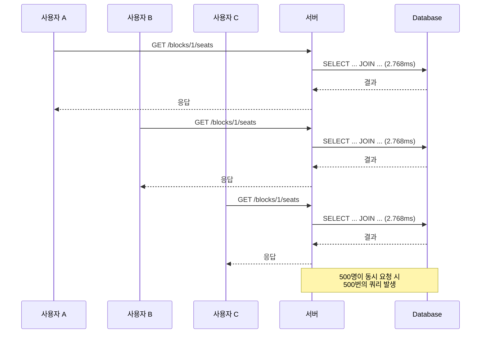
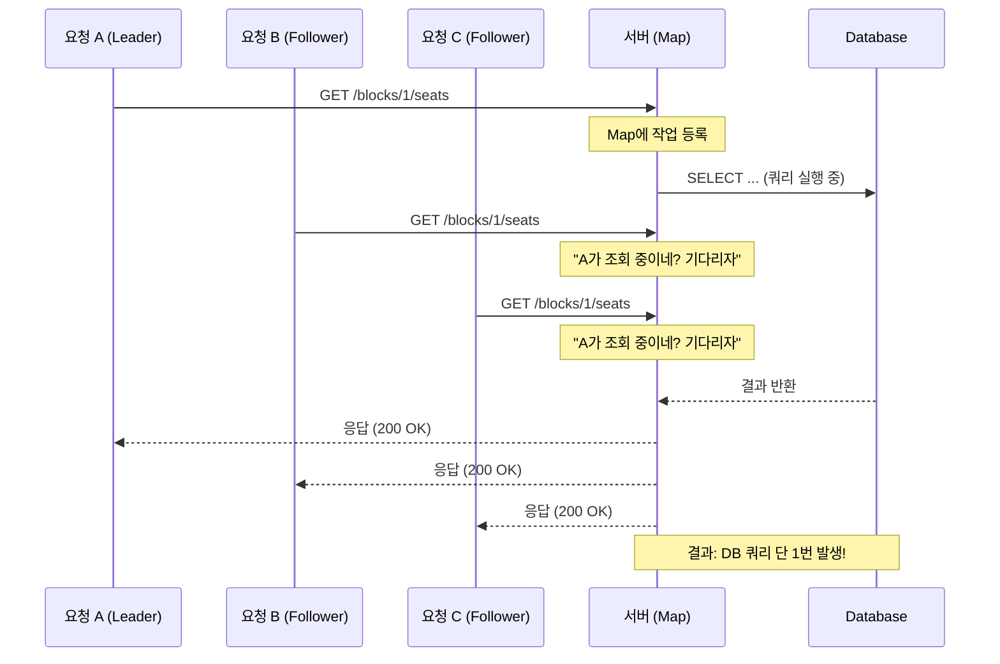
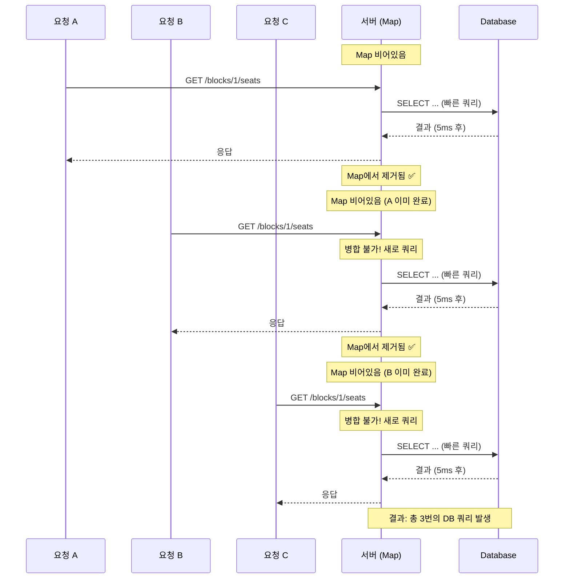

# 숨어 있던 병목 원인을 파헤쳐, 캐시 없이 좌석 현황 조회 성능 개선하기 (응답 속도 79% 개선)

## 배경 및 상황 (Context)

### 문제

티켓팅 서비스를 개발하면서 가장 신경 쓴 부분은 **실시간 좌석 현황 조회**였습니다. 사용자가 좌석을 선택할 때, 다른 사람이 이미 점유한 좌석인지 즉시 확인할 수 있어야 하기 때문입니다.

개발 초기에는 로컬 환경에서 테스트했을 때 응답 속도가 충분히 빨랐습니다. "이 정도면 괜찮겠지"라고 생각했죠. 하지만 실제 배포 환경에서 부하 테스트를 돌렸을 때, 예상치 못한 문제가 발생했습니다.

**동시 접속자 500명이 특정 블록의 좌석 현황을 조회했을 때:**

- 평균 응답 시간: **2초**
- p(99) 응답 시간: **4.84초** (상위 5% 사용자는 거의 5초를 기다려야 함)
- 처리량: **193 req/s** (서버 자원 대비 너무 낮음)

티켓팅 오픈 상황에서 5초는 치명적입니다. 사용자는 "왜 이렇게 느려?"라고 생각하며 이탈할 가능성이 높습니다. 더 심각한 건, 이 정도 부하에서도 서버가 버거워한다는 점이었습니다.


### 원인과 현상 분석

문제의 원인을 찾기 위해 가장 먼저 한 일은 **쿼리 실행 계획을 확인**하는 것이었습니다.

**Schema & Query**

```sql
-- 기존 쿼리: seat 테이블과 JOIN
SELECT allocation.id, allocation.match_id, allocation.seat_id, allocation.status, seat.block_id
FROM allocations AS allocation
JOIN seats AS seat ON allocation.seat_id = seat.id
WHERE allocation.match_id = ? AND seat.block_id = ?
```

언뜻 보면 문제가 없어 보입니다. 하지만 `**EXPLAIN ANALYZE** 결과 (배포 서버 실측):

```
Hash Join  (cost=11.29..276.55 rows=100 width=58) (actual time=0.149..2.680 rows=100 loops=1)
  Hash Cond: (a.seat_id = s.id)
  -> Seq Scan on allocations a  (cost=0.00..239.00 rows=10000 width=50) ← 전체 스캔!
        (actual time=0.059..1.516 rows=10000 loops=1)
        Filter: (match_id = 1)
  -> Hash  (cost=10.04..10.04 rows=100 width=16) (actual time=0.077..0.078 rows=100 loops=1)
        Buckets: 1024  Batches: 1  Memory Usage: 13kB
        -> Index Scan using idx_seats_block_id on seats s
              (cost=0.29..10.04 rows=100 width=16) (actual time=0.018..0.043 rows=100 loops=1)
              Index Cond: (block_id = 1)

Planning Time: 0.542 ms
Execution Time: 2.768 ms
```

**`allocations` 테이블을 전체 스캔(Seq Scan)하고 있었습니다.**

왜 이런 일이 발생했을까요? 문제는 `blockId`가 `seats` 테이블에만 존재한다는 점이었습니다. `allocations` 테이블에는 `matchId`와 `seatId`만 있었기 때문에, `WHERE allocation.match_id = ? AND seat.block_id = ?` 조건을 만족하려면 어쩔 수 없이 JOIN을 해야 했습니다.

결과적으로:
1. `allocations` 테이블 전체를 스캔
2. `seats` 테이블과 JOIN
3. 그 후에야 `blockId` 필터링

이 과정이 매번 반복되면서 성능 병목이 발생한 것입니다.

**반복되는 요청**

더 큰 문제는 이 쿼리가 **초당 수백 번씩 반복**된다는 점이었습니다. 티켓팅 오픈 시 사용자들이 동시에 같은 블록의 좌석 현황을 조회하면, 서버는 같은 느린 쿼리를 계속 실행해야 했습니다.




500명이 동시에 요청하면 500번의 쿼리가 발생합니다. 네트워크 지연까지 더해지면 응답 시간은 기하급수적으로 늘어났습니다.

## 고려된 대안들 (Proposed Options)

문제를 인식한 후, 해결 방법을 고민하기 시작했습니다. 가장 먼저 떠오른 건 역시 **"캐시를 넣으면 되지 않을까?"**였습니다.

### 대안 1: 캐시 (Cache)

Redis나 Caffeine 같은 캐시를 도입하면 DB 부하를 대폭 줄일 수 있습니다. 한 번 조회한 데이터를 메모리에 저장해두고, 같은 요청이 오면 DB를 거치지 않고 바로 응답하는 방식입니다.

```java
@Cacheable(value = "seatStatus", key = "#matchId + ':' + #blockId")
public AllocationStatusSnapShot getSnapshot(Long matchId, Long blockId) {
    // DB 조회
}
```

**장점:**
- 구현이 간단합니다. `@Cacheable` 어노테이션만 추가하면 됩니다.
- DB 부하를 대폭 줄일 수 있습니다.

**단점:**
- **실시간성 문제**: TTL(Time To Live) 동안 오래된 데이터(stale data)를 반환할 수 있습니다.
- 좌석 현황은 실시간으로 변경됩니다. 사용자 A가 좌석을 점유했는데, 캐시 때문에 사용자 B에게는 여전히 "사용 가능"으로 보인다면? 사용자 B는 이미 점유된 좌석을 클릭하게 되고, "이미 점유된 좌석입니다"라는 에러를 받게 됩니다. 이는 사용자 경험을 크게 해칩니다.

**판단**: 티켓팅 서비스에서 실시간성은 타협할 수 없는 요구사항입니다. 캐시는 최후의 수단으로 남겨두기로 했습니다.

---

### 대안 2: 요청 병합 (Request Collapsing)

다음으로 고려한 방법은 **Request Collapsing**입니다. 동시에 들어온 같은 요청을 하나로 합쳐서 DB 쿼리를 1번만 실행하는 패턴입니다.

```java
CompletableFuture<Snapshot> future = inFlightSnapshots.computeIfAbsent(key, k ->
    CompletableFuture.supplyAsync(() -> loadFromDb(matchId, blockId))
);
return future.get(5, TimeUnit.SECONDS);
```

**이론상으로는 완벽해 보였습니다.** 500명이 동시에 요청해도 DB 쿼리는 1번만 실행하고, 나머지는 그 결과를 공유하면 됩니다.



하지만 새로운 문제가 있었습니다.


**쿼리가 빠르면 효과가 없다**는 점입니다.




쿼리가 5ms만에 끝나면, 다음 요청이 도착하기 전에 이미 Map에서 제거됩니다. 병합할 요청이 없는 거죠.


**하지만 쿼리가 느릴 때는 효과가 있었습니다.**

JOIN 방식의 느린 쿼리(~2초)로 테스트했을 때:

| 지표 | Before | After (Collapsing) | 개선율 |
|------|--------|-------------------|--------|
| 평균 | 2000ms | **429ms** | **79% 개선** |
| p(95) | 4.49s | **1.08s** | **76% 개선** |
| 처리량 | 193 req/s | **708 req/s** | **3.7배 증가** |

쿼리 실행 시간이 길어지면 그 동안 동시 요청이 쌓여서 병합 효과가 발생한 것입니다.

**판단**: Request Collapsing은 느린 쿼리에서만 효과적입니다. 근본적인 해결책은 **쿼리 자체를 빠르게 만드는 것**이라는 결론에 도달했습니다.

---

### 대안 3: 비정규화 (Denormalization)

마지막으로 고려한 방법은 **비정규화**입니다. `allocations` 테이블에 `blockId` 컬럼을 추가하여 JOIN을 제거하는 방식입니다.

```java
@Table(name = "allocations", indexes = {
    @Index(name = "idx_match_seat_unique", columnList = "matchId, seatId", unique = true),
    @Index(name = "idx_match_block", columnList = "matchId, blockId"),  // 추가
})
public class AllocationEntity {
    private Long matchId;
    private Long seatId;
    private Long blockId;  // 비정규화 추가
    private AllocationStatus status;
    // ...
}
```

**변경 후 쿼리:**

```sql
-- JOIN 제거, allocation 단독 조회
SELECT * FROM allocations
WHERE match_id = ? AND block_id = ?
```

**EXPLAIN ANALYZE** 결과 (배포 서버 실측):

```
Bitmap Heap Scan on allocations  (cost=5.31..122.25 rows=100 width=58) (actual time=1.525..1.542 rows=100 loops=1)
  Recheck Cond: ((match_id = 1) AND (block_id = 1))
  Heap Blocks: exact=3
  -> Bitmap Index Scan on idx_match_block_updated  (cost=0.00..5.29 rows=100 width=0)
        (actual time=1.496..1.496 rows=102 loops=1)
        Index Cond: ((match_id = 1) AND (block_id = 1))

Planning Time: 0.183 ms
Execution Time: 1.604 ms
```

**쿼리 속도가 42% 빨라졌습니다** (2.768ms → 1.604ms).

**장점:**
- JOIN 제거로 쿼리가 단순해지고 빨라집니다.
- 인덱스를 완전히 활용할 수 있습니다.
- 실시간성 문제가 없습니다.

**단점:**
- 저장 공간이 약간 증가합니다 (`blockId` 컬럼 추가).
- 데이터 일관성을 수동으로 관리해야 합니다. `seat.blockId`가 변경되면 `allocation.blockId`도 업데이트해야 합니다.

**하지만 이 단점은 감수할 만했습니다:**
1. 좌석의 `blockId`는 **사실상 불변**입니다. 한 번 설정되면 변경될 일이 거의 없습니다.
2. 좌석 현황은 **read-heavy** 워크로드입니다. 조회가 수정보다 압도적으로 많습니다.
3. 접근 패턴이 명확합니다. `WHERE matchId = ? AND blockId = ?`가 핵심 쿼리라는 건 도메인 지식으로 알 수 있습니다.

---

## 결정 (Decision)

고민 끝에 **비정규화 + Request Collapsing 조합**을 선택했습니다.

### 선택 이유

1. **근본적인 해결**: 캐시는 병목을 DB에서 Redis로 옮길 뿐이고, Request Collapsing은 쿼리 속도에 의존합니다. 비정규화는 쿼리 자체를 빠르게 만드는 근본적인 해결책입니다.

2. **실시간성 보장**: 캐시와 달리 stale data 문제가 없습니다. 항상 최신 데이터를 조회합니다.

3. **도메인 지식 기반 설계**: "Premature Optimization"은 추측에 기반한 최적화를 경계하는 것이지, 도메인 지식에 기반한 설계를 하지 말라는 뜻이 아닙니다. 티켓팅 서비스에서 `matchId + blockId` 조회가 핵심 쿼리라는 건 명확합니다.

4. **Request Collapsing 추가**: 비정규화만으로도 충분히 빠르지만, 느린 쿼리 상황에서 추가 보호막 역할을 합니다.

### 대안 비교표

| 항목 | 캐시 | Request Collapsing | 비정규화 |
|------|------|-------------------|----------|
| 구현 복잡도 | 낮음 | 중간 | 낮음 |
| 실시간성 | ❌ stale 가능 | ✅ 보장 | ✅ 보장 |
| DB 부하 감소 | ✅ 대폭 감소 | ⚠️ 쿼리 속도에 의존 | ✅ 근본 해결 |
| 병목 이동 | ⚠️ Redis로 이동 | ❌ 없음 | ❌ 없음 |
| 데이터 일관성 | ⚠️ TTL 동안 불일치 | ✅ 보장 | ⚠️ 수동 관리 필요 |
| 선택 | ❌ | ⚠️ 보조 수단 | ✅ 주 전략 |

---

## 결과 및 영향 (Consequences)

### 성과 (Before & After)

배포 서버에서 500 VU Burst 테스트를 진행한 결과:

| 지표 | Before (JOIN) | After (비정규화 + Collapsing) | 개선율 |
|------|---------------|-------------------------------|--------|
| **p(99)** | 4.84s | **2.21s** | **54% 단축** ⬇️ |
| **p(95)** | 4.49s | **1.08s** | **76% 단축** ⬇️ |
| **평균** | 2000ms | **429ms** | **79% 단축** ⬇️ |
| **처리량** | 193 req/s | **708 req/s** | **3.7배 증가** ⬆️ |
| **DB 쿼리** | 2.768ms | **1.604ms** | **42% 향상** ⬆️ |


### 장점 (기대효과)

1. **사용자 경험 개선**: 좌석 현황 로딩 속도가 대폭 개선되어 티켓팅 오픈 시 이탈률 감소가 기대됩니다.

2. **서버 처리량 증가**: 같은 서버 자원으로 3.7배 더 많은 요청을 처리할 수 있게 되었습니다. 인프라 비용 절감 효과도 있습니다.

3. **확장성 확보**: 쿼리가 빨라지면서 더 많은 동시 접속자를 감당할 수 있는 여유가 생겼습니다.

### 부담/감수해야 할 부분 (Trade Off)

1. **저장 공간 증가**: `allocations` 테이블에 `blockId` 컬럼이 추가되면서 저장 공간이 약간 증가했습니다. 하지만 BIGINT 컬럼 하나 추가로 인한 증가량은 미미합니다.

2. **데이터 일관성 관리**: `seat.blockId`가 변경되면 `allocation.blockId`도 수동으로 업데이트해야 합니다. 하지만 좌석의 블록은 사실상 변경되지 않기 때문에 실무에서 문제가 될 가능성은 낮습니다.

3. **마이그레이션 비용**: 기존 데이터에 `blockId`를 채워넣는 마이그레이션 작업이 필요했습니다. 하지만 이는 일회성 작업이고, 지속적인 JOIN 비용보다 훨씬 저렴합니다.

### 배운 교훈

1. **캐시가 항상 정답은 아니다**: 실시간성이 중요한 데이터는 쿼리 최적화가 더 근본적인 해결책일 수 있습니다.

2. **비정규화는 죄가 아니다**: 접근 패턴이 명확하고 데이터가 불변에 가까우면, 설계 시점부터 비정규화를 고려하는 것이 합리적입니다.

3. **측정 없이 최적화 없다**: `EXPLAIN ANALYZE`, k6 부하 테스트로 정량적으로 비교해야 설득력 있는 의사결정을 할 수 있습니다.

4. **Request Collapsing의 함정**: 쿼리가 빠르면 병합 효과가 없습니다. 비동기 구현 시 `ForkJoinPool` 병목도 주의해야 합니다.

---

## 참고 (Reference)

### 관련 개념

- [Cloudflare - Cache Revalidation](https://developers.cloudflare.com/cache/concepts/revalidation/)
- [Vercel - CDN Request Collapsing](https://vercel.com/blog/cdn-request-collapsing)

### 프로젝트 문서

- `allocation-query-optimization.md` - 상세 최적화 과정
- `engineering-note-allocation-denormalization.md` - 비정규화 전략
- `request-collapsing-implementation.md` - Request Collapsing 트러블슈팅

### 커밋

- `1fe8a40` - 비정규화 (blockId 추가)
- `8bcc607` - 인덱스 최적화
