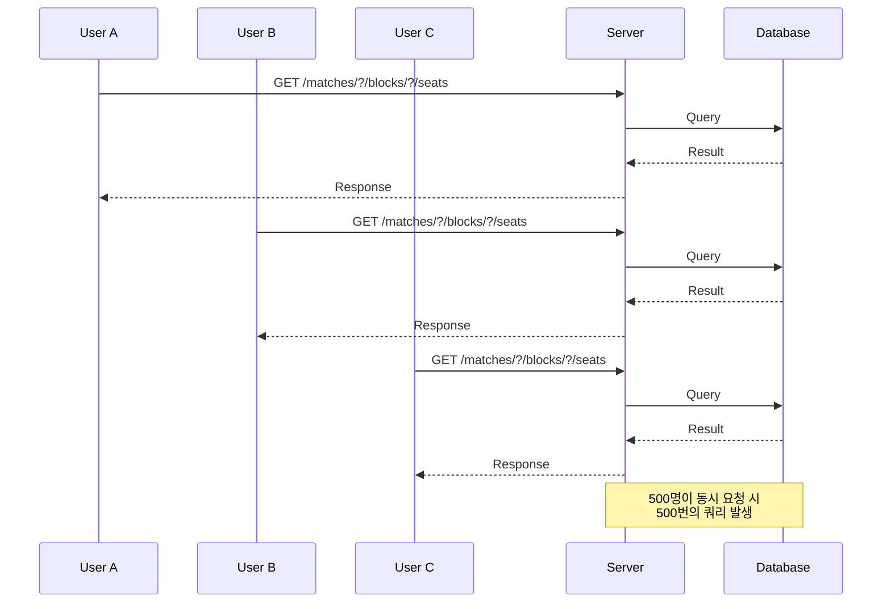
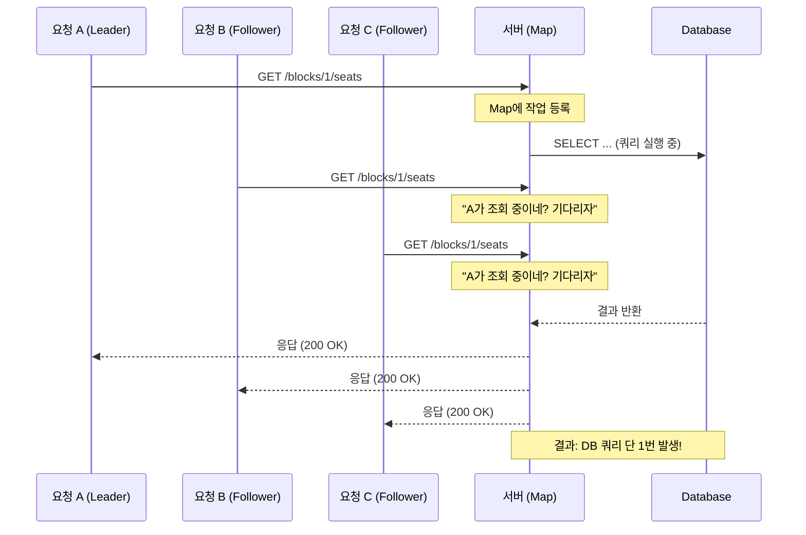
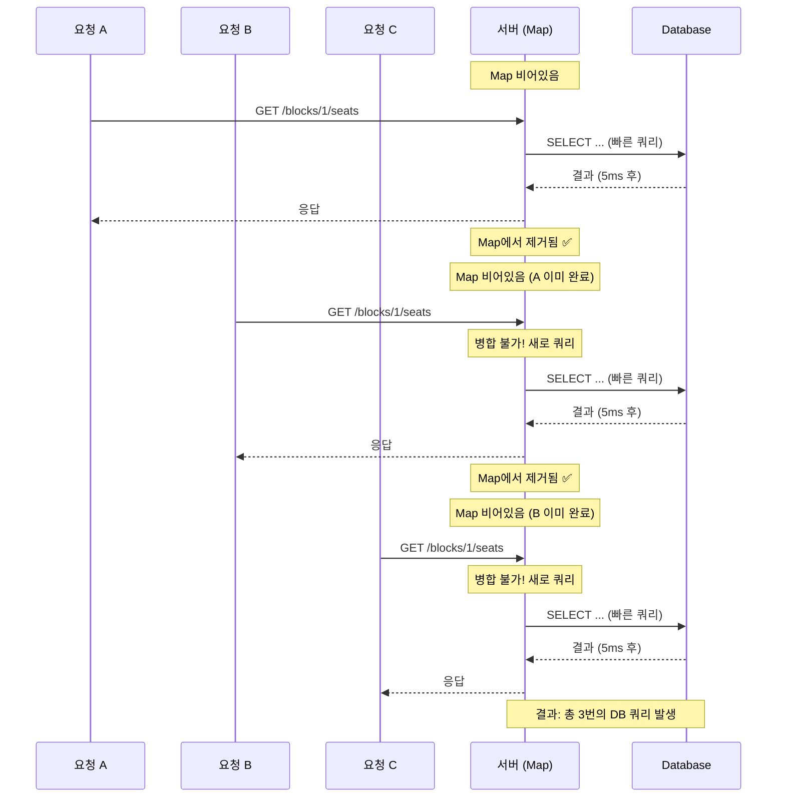

## 배경 및 상황 (Context)

### 해결하고자 하는 문제

야구 경기 예매 시작시 발생하는 ‘구역별 좌석 현황 조회’ 기능의 병목을 해결하고, 응답속도를 개선하고 DataBase 부하 문제를 해결하고자 한다.

좌석 점유 경쟁이 치열한 서비스 특성상, 1초 미만의 최신 데이터 반영

### 현재 상황(AS-IS)의 문제 및 한계점

동시 접속자 1,000명이 특정 구역의 좌석 현황을 조회하였을 떄 (배포 서버 기준)

|  | 목표치 | 측정치 | 결과 |
| --- | --- | --- | --- |
| 동시 접속자 수 | 10,000 (Vuser) | 1,000 (Vuser) | 실패 |
| 처리 성능
Throughput / Transaction Per Second (TPS) | 10,000 (TPS) | 평균 : ~200 (TPS) / 최대 : ~570 (TPS) | 실패 |
| 응답 시간
Latency | < 1 (s) | 1.28 (s) | 실패 |
| 실패 비율
Error Rate | < 1 (%) | 0.00 (%) | 실패 |

CPU, Memory, Latency, TPS (그라파나)

- CPU
- Memory
- Latency
- Throughput / Transaction Per Second (TPS)

### 목표와 개선 방향(TO-BE)

### 원인과 현상 분석

**Schema**


- Schema : 배정(Allocations)에는 좌석(Seat) 정보만 존재하며, 구역(Block) 정보는 좌석에만 존재합니다.

**Query**

```sql
-- 기존 쿼리: seat 테이블과 JOIN
SELECT allocation.id, allocation.match_id, allocation.seat_id, allocation.`status`, seat.block_id
FROM allocations AS allocation
JOIN seats AS seat ON allocation.seat_id = seat.id
WHERE allocation.match_id = ? AND seat.block_id = ?

```

- 좌석 현황 조회는 구역(Block) 단위로 이루어짐, 특정 구역의 좌석을 조회하려면 배정 테이블과 좌석 테이블을 JOIN 해야 합니다.

- 그리고 하지만 `WHERE seat.block_id = ?` 조건을 조회하기 위해서는 JOIN이 필요

실제로 Query 실행 계획 및 결과(`EXPLAN ANALYZE`)를 살펴보면, 

```
Hash Join  (cost=11.29..276.55 rows=100 width=58) (actual time=0.149..2.680 rows=100 loops=1)
  Hash Cond: (a.seat_id = s.id)
  -> Seq Scan on allocations a  (cost=0.00..239.00 rows=10000 width=50) ← 전체 스캔!
        (actual time=0.059..1.516 rows=10000 loops=1)
        Filter: (match_id = 1)
  -> Hash  (cost=10.04..10.04 rows=100 width=16) (actual time=0.077..0.078 rows=100 loops=1)
        Buckets: 1024  Batches: 1  Memory Usage: 13kB
        -> Index Scan using idx_seats_block_id on seats s
              (cost=0.29..10.04 rows=100 width=16) (actual time=0.018..0.043 rows=100 loops=1)
              Index Cond: (block_id = 1)

Planning Time: 0.542 ms
Execution Time: 2.768 ms

```

**`allocations` 테이블을 전체 스캔(Seq Scan)하고 있었습니다.**

왜 이런 일이 발생했을까요? 문제는 `blockId`가 `seats` 테이블에만 존재한다는 점이었습니다. `allocations` 테이블에는 `matchId`와 `seatId`만 있었기 때문에, `WHERE allocation.match_id = ? AND seat.block_id = ?` 조건을 만족하려면 어쩔 수 없이 JOIN을 해야 했습니다.

결과적으로:

1. `allocations` 테이블 전체를 스캔
2. `seats` 테이블과 JOIN
3. 그 후에야 `blockId` 필터링

이 과정이 매번 반복되면서 성능 병목이 발생한 것입니다.

**반복되는 요청**

다른 문제로는 예매 시작 시, 사용자들이 동시에 같은 구역의 좌석 현황을 조회할 때, 같은 정보를 여러 번 가져와야한다는 문제가 있다.



---

## 고려된 대안들 (Proposed Options)

### 캐시 (Cache)

Guava/Caffeine과 같은 Local 캐시나 Redis와 같은 분산 Cache를 도입하면 DB 부하를 대폭 줄일 수 있다.

한 번 조회한 데이터를 메모리에 저장해두고, 같은 요청이 오면 DB를 거치지 않고 바로 응답하는 방식

```java
@Cacheable(value = "allocationStatusSnapShot", key = "#matchId + ':' + #blockId")
public AllocationStatusSnapShot getSnapshot(Long matchId, Long blockId) {
    // DB 조회
}
```

**장점:**

- 구현이 간단합니다. `@Cacheable` 어노테이션만 추가하면 됩니다.
- DB 부하를 대폭 줄일 수 있습니다.

**단점:**

- **실시간성 문제**: TTL(Time To Live) 동안 오래된 데이터(stale data)를 반환할 수 있습니다.
- 좌석 현황은 실시간으로 변경됩니다. 사용자 A가 좌석을 점유했는데, 캐시 때문에 사용자 B에게는 여전히 "사용 가능"으로 보인다면? 사용자 B는 이미 점유된 좌석을 클릭하게 되고, "이미 점유된 좌석입니다"라는 에러를 받게 됩니다. 이는 사용자 경험을 크게 해칩니다.

**판단**: 티켓팅 서비스에서 실시간성은 타협할 수 없는 요구사항입니다. 캐시는 최후의 수단으로 남겨두기로 했습니다.

### 요청 병합 (Request Collapsing)

```java
CompletableFuture<Snapshot> future = inFlightSnapshots.computeIfAbsent(key, k ->
    CompletableFuture.supplyAsync(() -> loadFromDb(matchId, blockId))
);

return future.get(5, TimeUnit.SECONDS);
```

동시에 요청해도 DB Query는 1번만 실행하고, 나머지는 그 결과를 공유하면 됩니다.



```markdown
**하지만 쿼리가 느릴 때는 효과가 있었습니다.**

JOIN 방식의 느린 쿼리(~2초)로 테스트했을 때:

| 지표 | Before | After (Collapsing) | 개선율 |
|------|--------|-------------------|--------|
| 평균 | 2000ms | **429ms** | **79% 개선** |
| p(95) | 4.49s | **1.08s** | **76% 개선** |
| 처리량 | 193 req/s | **708 req/s** | **3.7배 증가** |

쿼리 실행 시간이 길어지면 그 동안 동시 요청이 쌓여서 병합 효과가 발생한 것입니다.

**판단**: Request Collapsing은 느린 쿼리에서만 효과적입니다. 근본적인 해결책은 **쿼리 자체를 빠르게 만드는 것**이라는 결론에 도달했습니다.
```

쿼리가 오래 걸리면 효과가 있었다. 근데 쿼리가 빠르면 효과가 없다. 
쿼리가 빨리 끝나면, 다음 요청이 도착하기 전에 이미 Map에서 제거된다. 

병합할 요청이 없다.



### 비정규화 (Denormalization)


배정(Allocation)에 구역(Block) 정보까지 포함하여 비정규화하여 JOIN을 제거

```markdown
| 장점 | 단점 |
|------|------|
| JOIN 제거, 쿼리 8배 빨라짐 | 저장 공간 약간 증가 |
| 인덱스 완전 활용 가능 | 데이터 일관성 수동 관리 필요 |

**판단**: read-heavy 워크로드에 적합. `blockId`는 사실상 불변.
```

## 결정 (Decision)

비정규화만으로 충분함

제안하고자 하는 내용 및 해당 결정의 이유에 대해 설명

의사 결정 과정에서 고려했던 대안들과 장단점에 대한 내용도 포함

간단히 비교하는 표를 추가해서 읽는 사람들이 더 쉽게 이해할 수 있도록

선택한 대안과 이유 (성능, 비용, 운영 편의성 등)

## 결과 및 영향 (Consequences)

결정을 통해 사용자가 받는 영향에 대해 정의

결정이 도입된다면 어떤 효과가 나타날 수 있는지
장점과 단점, 트레이드 오프

장점 (기대효과)

부담/감수해야 할 부분 (Trade Off)